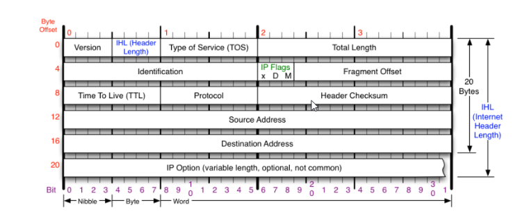

# Direccionamiento IP - Conceptos básicos de binario

El documento introduce los sistemas numéricos utilizados en redes, destacando la importancia de las direcciones IP y el sistema binario como su base fundamental.

## 1. Sistemas Numéricos y Bases

Las direcciones IP se representan comúnmente en formato decimal (decimal punteado), pero internamente las computadoras usan el sistema binario.

| Sistema Numérico | Base | Dígitos Posibles | Notas Clave                                                                                                                            |
| :--------------- | :--- | :--------------- | :------------------------------------------------------------------------------------------------------------------------------------- |
| **Decimal**      | 10   | 0 a 9            | La base más común para los humanos. Cada dígito vale $10^x$ más que el anterior.                                                       |
| **Binario**      | 2    | 0 y 1            | El lenguaje fundamental de las computadoras (encendido/apagado). Cada dígito (bit) vale $2^x$ más que el anterior (1, 2, 4, 8, 16...). |
| **Octal**        | 8    | 0 a 7            | Menos común, pero usado en algunos contextos.                                                                                          |
| **Hexadecimal**  | 16   | 0 a 9, A a F     | Utiliza letras para los valores del 10 al 15 (A=10, F=15). Ofrece una representación más compacta que el binario.                      |

## 2. Conversión entre Binario y Decimal

### A. De Binario a Decimal

Se suma el valor posicional de cada dígito (bit) que contiene un **1**, ignorando los que contienen un 0.

- **Ejemplo:** Para el binario $11011010$: $128 + 64 + 0 + 16 + 8 + 0 + 2 + 0 = 218$.

### B. De Decimal a Binario

Se identifica el valor posicional binario más grande que se puede restar del número decimal.

1. Se coloca un **1** en esa posición y se resta el valor.
2. Se repite el proceso con el resto, colocando un **0** en las posiciones que son demasiado grandes para ser restadas.
3. El proceso continúa hasta que el resto es 0.

- **Ejemplo:** Para convertir 235: $235 - 128 = 107$ ($1$ en 128). $107 - 64 = 43$ ($1$ en 64). $43 - 32 = 11$ ($1$ en 32). $11 - 16$ (imposible, $0$ en 16). $11 - 8 = 3$ ($1$ en 8). $3 - 2 = 1$ ($1$ en 2). $1 - 1 = 0$ ($1$ en 1).
- **Resultado (235 en binario):** $11101011$.

### C. Conversión de Cualquier Base a Decimal

Se dibuja una tabla donde los encabezados de las columnas representan la base elevada a potencias crecientes ($Base^0, Base^1, Base^2$, etc.). Luego se multiplica el dígito por su valor posicional y se suman los resultados.

## 3. Cálculo de Representaciones Numéricas (Rangos)

Para calcular el número total de representaciones numéricas posibles (o el rango), se utiliza la fórmula:

$$Representaciones = Base^{Número\ de\ Dígitos}$$

- **Binario (4 dígitos):** $2^4 = 16$ números posibles (rango de 0 a 15).
- **Octal (4 dígitos):** $8^4 = 4.096$ números posibles (rango de 0 a 4.095).
- **Decimal (4 dígitos):** $10^4 = 10.000$ números posibles (rango de 0 a 9.999).
- **Hexadecimal (4 dígitos):** $16^4 = 65.536$ números posibles (rango de 0 a 65.535).

## Estructura de Direcciones IP y Clases de Red (IPv4)

Este segmento detalla la estructura del Protocolo de Internet versión 4 (IPv4), que es el estándar fundamental para identificar y localizar dispositivos en las redes.

### 1. Estructura de la Dirección IPv4

Una dirección IPv4 es un número entero de **32 bits** expresado en notación decimal punteada (ej. 192.0.2.126).

- **Esquema de 32 bits:** La dirección se divide en 4 segmentos llamados **Octetos** (ya que cada segmento tiene 8 bits).
- **Rango de Octeto:** Cada octeto representa 8 dígitos binarios ($2^8 = 256$ valores posibles) y su valor en decimal va de **0 a 255**.
- **Rango Total de Direcciones:** IPv4 ofrece un total de $2^{32}$ (aproximadamente 4.3 mil millones) de direcciones posibles (desde 0.0.0.0 hasta 255.255.255.255).

#### Partes de una Dirección IPv4:

1. **Parte de Red:** Identifica la red única a la que pertenece el dispositivo (uniforme en todos los hosts de la red).
2. **Parte de Host:** Identifica de manera única a la máquina o dispositivo individual dentro de esa red. (Debe variar entre hosts).
3. **Número de Subred:** Una parte opcional utilizada para dividir grandes redes locales en subredes más pequeñas.

### 2. Clases de Direccionamiento IPv4

Inicialmente, IPv4 utilizaba un esquema de direccionamiento con clases para organizar las direcciones según su alcance y uso.

| Clase | Rango de Dirección (Primer Octeto) | Máscara de Subred Predet. | Parte de Red (N) / Host (H) | Uso Principal                                                |
| :---- | :--------------------------------- | :------------------------ | :-------------------------- | :----------------------------------------------------------- |
| **A** | 0.0.0.0 a 127.255.255.255          | 255.0.0.0                 | N.H.H.H                     | Redes muy grandes (el primer octeto es la red).              |
| **B** | 128.0.0.0 a 191.255.255.255        | 255.255.0.0               | N.N.H.H                     | Redes de tamaño medio (los dos primeros octetos son la red). |
| **C** | 192.0.0.0 a 223.255.255.255        | 255.255.255.0             | N.N.N.H                     | Redes pequeñas (los tres primeros octetos son la red).       |
| **D** | 224.0.0.0 a 239.255.255.255        | N/A                       | Reservado                   | **Multidifusión** (Multicast Groups).                        |
| **E** | 240.0.0.0 a 255.255.255.255        | N/A                       | Reservado                   | **Uso experimental** y futuro.                               |

_Nota: La conversión entre decimal y binario sigue el método de valores posicionales descrito en el documento anterior._

### 3. Limitaciones de IPv4

A pesar de ser el protocolo fundamental desde 1983, el rápido crecimiento de dispositivos conectados ha expuesto varias limitaciones de IPv4, lo que condujo al desarrollo de IPv6:

- **Agotamiento de Direcciones:** El número total de direcciones de 32 bits es insuficiente.
- **Direccionamiento No Jerárquico:** Dificultad para renumerar direcciones.
- **Rendimiento:** Dificultades para garantizar la seguridad, brindar calidad de servicio (QoS), gestionar grandes tablas de enrutamiento y soportar el alojamiento múltiple (multihoming) y la multidifusión de manera eficiente.

## Protocolo IP y Enrutamiento del Tráfico

Este segmento aborda el papel esencial del Protocolo de Internet (IP) y las direcciones IP en el enrutamiento de paquetes de datos, así como los componentes cruciales para la administración de redes como las máscaras de subred y las puertas de enlace predeterminadas.

### 1. Protocolo IP y Direccionamiento

- **Protocolo IP:** Opera en la Capa 3 (Red). Utiliza el **encabezado IP** para identificar y procesar el tráfico que fluye en forma de paquetes. Los routers (y firewalls) inspeccionan las direcciones IP de destino (y origen).
- **Direcciones IP (IPv4):** Se representan en notación decimal punteada (cuatro octetos, ej. 10.195.210.10). Cada octeto es un número entero positivo entre 0 y 255.
- **Protocolos Enrutables:** Un protocolo enrutable (como IP) significa que el paquete de datos puede ser encaminado fuera de la red de origen (normalmente a través de Internet).

### 2. Componentes del Encabezado IP

El encabezado IP (que va al principio de cada paquete de datos) contiene información crucial para el enrutamiento:

| Componente                  | Función                                                                   | Notas Clave                                                                                                                                          |
| :-------------------------- | :------------------------------------------------------------------------ | :--------------------------------------------------------------------------------------------------------------------------------------------------- |
| **Versión del Protocolo**   | Identifica si el protocolo es IPv4 o IPv6.                                | Siempre es el primer elemento.                                                                                                                       |
| **TTL** (Tiempo de Vida)    | Limita el número de "saltos" (hops) que un paquete puede realizar.        | Es un campo de 8 bits (0-255). Se reduce en 1 en cada dispositivo de Capa 3. Si llega a 0, el paquete se descarta para evitar la congestión (loops). |
| **ID de Protocolo**         | Identifica el protocolo de la capa superior que transporta la carga útil. | Ejemplo: ICMP=1, TCP=6, UDP=17.                                                                                                                      |
| **Dirección IP de Origen**  | Identifica el punto final que envió el paquete.                           | Inspeccionada por firewalls con estado.                                                                                                              |
| **Dirección IP de Destino** | Identifica a dónde se envía el paquete.                                   | Inspeccionada por todos los routers.                                                                                                                 |
| **Carga Útil (Payload)**    | El contenido real del mensaje que se envía.                               | N/A                                                                                                                                                  |

### Estructura del Encabezado (Header) de un Paquete IP

| Campo                            | Longitud (bits) | Descripción                                                         |
| :------------------------------- | :-------------: | :------------------------------------------------------------------ |
| **Version**                      |        4        | Declara la versión del protocolo IP (ej. 4 para IPv4, 6 para IPv6). |
| **IHL** (Internet Header Length) |        4        | Longitud del encabezado IP en palabras de 32 bits.                  |
| **Service Type** (DSCP/ECN)      |        8        | Usado para calidad de servicio (QoS).                               |
| **Total Length**                 |       16        | Longitud total del datagrama (encabezado + datos) en bytes.         |
| **Identification**               |       16        | Usado para identificar fragmentos.                                  |
| **Flags**                        |        3        | Banderas de control de fragmentación.                               |
| **Fragment Offset**              |       13        | Indica la posición de este fragmento en el datagrama original.      |
| **TTL** (Time To Live)           |        8        | Número de saltos máximos.                                           |
| **Protocol**                     |        8        | Define el protocolo de capa superior (ej. TCP, UDP).                |
| **Header Checksum**              |       16        | Suma de verificación solo para el encabezado IP.                    |
| **Source IP Address**            |       32        | La dirección IP del remitente.                                      |
| **Destination IP Address**       |       32        | La dirección IP del destinatario.                                   |
| **Options**                      |    Variable     | Campos opcionales.                                                  |
| **Padding**                      |    Variable     | Relleno para asegurar el límite de 32 bits.                         |
| **Payload** (Datos)              |    Variable     | Los datos reales transportados.                                     |

### 3. Componentes Clave del Direccionamiento IP

#### Máscara de Red (Máscara de Subred)

- **Función:** La máscara de red es una asignación de bits utilizada por el host o el router para **dividir** la dirección IP en dos segmentos: la **parte de red** (y subred) y la **parte de host**.
- **Prefijo de Dirección IP:** La notación de barra (ej. `/24`) indica cuántos bits, comenzando desde la izquierda, están dedicados a la porción de red.
  - Ejemplo: `/24` significa que los primeros 24 bits (o tres octetos) son la red, y los 8 bits restantes (el último octeto) son para el host.

#### Puerta de Enlace Predeterminada (Default Gateway)

- **Función:** Es la dirección IP del router que conecta la red local con redes externas (como Internet).
- **Enrutamiento:** Los paquetes que deben salir de la red local (ir a una dirección IP externa) se envían a la Puerta de Enlace Predeterminada para que esta los reenvíe.

#### Dirección IP de Transmisión (Broadcast IP)

- **Función:** Se utiliza para la comunicación simultánea con **todos los dispositivos** dentro de un segmento de red.
- **Cálculo:** Se obtiene tomando la parte de red de la dirección IP original y configurando **todos los bits** de la parte de host a **uno** (binario $11111111$), lo que resulta en $255$ en decimal para el octeto de host.
  - Ejemplo: Si la IP es 192.168.52.3 con prefijo /24, la dirección de transmisión es 192.168.52.**255**.

## Introducción al Esquema de Direcciones IPv6

IPv6 es el sucesor de IPv4, diseñado para superar las limitaciones de agotamiento de direcciones y mejorar la seguridad y la eficiencia del enrutamiento.

### 1. Estructura de la Dirección IPv6

- **Longitud:** 128 bits (cuatro veces más larga que la dirección IPv4 de 32 bits).
- **Notación:** Utiliza números **Hexadecimales** y se divide en **8 grupos** de 4 dígitos hexadecimales cada uno, separados por dos puntos.
  - Cada grupo hexadecimal de 4 dígitos equivale a 16 bits. $8\ grupos \times 16\ bits/grupo = 128\ bits$.

#### Reglas de Representación (Abreviatura)

- **Omisión de Ceros a la Izquierda:** Los ceros iniciales en un grupo hexadecimal pueden omitirse.
- **Sustitución de Ceros Consecutivos (Doble Punto):** Se pueden usar dos puntos dobles (`::`) para representar cualquier número de grupos de ceros consecutivos.
  - **Excepción:** La sustitución con doble punto (`::`) solo puede usarse **una vez** en una dirección IPv6 para evitar ambigüedad.
- **Notación Mixta:** IPv6 puede escribirse en notación mixta con IPv4 para compatibilidad (Ejemplo: `FFFF::192.0.2.128`).

### 2. Esquemas de Direccionamiento IP

El direccionamiento describe cómo se comunican los dispositivos entre sí:

| Esquema       | Comunicación (IPv4)  | Comunicación (IPv6)        | Definición                                                                                                                                |
| :------------ | :------------------- | :------------------------- | :---------------------------------------------------------------------------------------------------------------------------------------- |
| **Unicast**   | Uno a uno            | Uno a uno                  | Una dirección identifica de forma única a un único nodo. (Común en IPv4 e IPv6).                                                          |
| **Multicast** | Uno a muchos         | Uno a muchos               | Los paquetes se envían a un grupo de sistemas suscritos (direcciones Clase D en IPv4).                                                    |
| **Broadcast** | Uno a todos (Subred) | **Sustituido por Anycast** | Los paquetes se envían a todos los hosts de la subred (parte de host con todos los bits a 1).                                             |
| **Anycast**   | N/A                  | Uno al más cercano         | Una dirección se asigna a múltiples interfaces (típicamente en diferentes ubicaciones) y el paquete se enruta al punto final más cercano. |

### 3. Cabecera IPv6 vs. Cabecera IPv4

La estructura de la cabecera IPv6 se simplificó en comparación con IPv4, lo que mejora la eficiencia del enrutamiento:

- **IPv6:** Tiene **menos componentes** y una estructura más sencilla. Contiene la Versión, la Dirección de Origen (128 bits) y la Dirección de Destino (128 bits), entre otros campos.
- **IPv4:** Incluye campos como TTL (Time to Live) y Protocolo ID.

### 4. Ventajas de IPv6

- **Mayor Espacio de Direcciones:** El aumento de 32 a 128 bits resuelve la escasez de direcciones.
- **Seguridad Integrada:** Incluye **IPsec** (Integridad, Autenticación y Cifrado de datos) de forma nativa.
- **Eficiencia de Procesamiento:** La estructura de encabezado más sencilla reduce los costos de procesamiento en los routers y aumenta la velocidad.
- **Calidad de Servicio (QoS):** Mejores características para priorizar aplicaciones críticas (asegurando ancho de banda y baja latencia).
- **Soporte Móvil:** Mejor soporte para dispositivos móviles, lo que facilita conexiones a Internet más rápidas y seguras.
