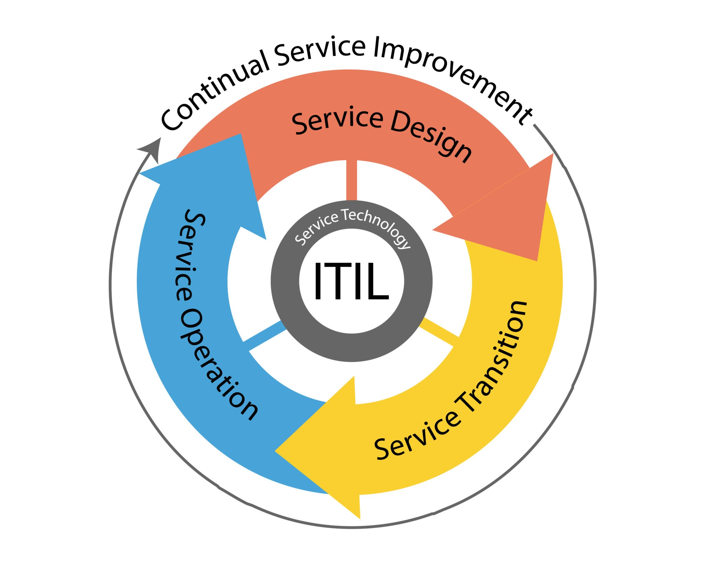
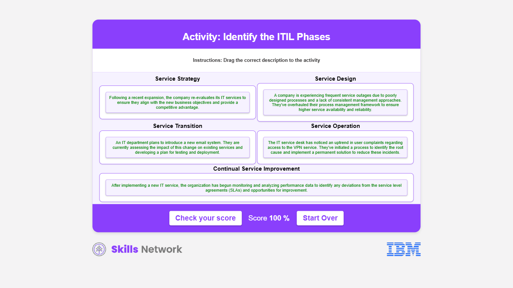

# Síntesis y Estructura del Ciclo de Vida del Servicio ITIL

ITIL (Information Technology Infrastructure Library) es un marco de mejores prácticas para la **Gestión de Servicios de TI (ITSM)**. Su propósito es garantizar la creación de valor para el cliente a través de la entrega eficiente de servicios.

El marco se estructura en **cinco etapas principales** que representan el ciclo de vida del servicio.

---

## 1. Estrategia del Servicio (Service Strategy)

Sienta las bases para **crear valor** para el cliente. Define los objetivos, el mercado, y cómo los servicios de TI ayudarán a lograr los objetivos estratégicos de la empresa.

| Proceso Clave                | Propósito Principal                                                                 |
| :--------------------------- | :---------------------------------------------------------------------------------- |
| **Definición del Mercado**   | Identificar las necesidades del cliente y el mercado de la organización.            |
| **Ofertas de Servicios**     | Desarrollar las ofertas de servicios que satisfarán estas necesidades.              |
| **Planificación Financiera** | Crear un plan financiero para los servicios de TI (administrar recursos y riesgos). |
| **Gestión Estratégica**      | Determinar cómo aprovechar los servicios para lograr objetivos.                     |

---

## 2. Diseño del Servicio (Service Design)

Garantiza que los servicios **nuevos, modificados o retirados** cumplan con los objetivos comerciales. Se enfoca en diseñar servicios **escalables, confiables y eficientes**.

| Proceso Clave                                        | Propósito Principal                                                                                                                                             |
| :--------------------------------------------------- | :-------------------------------------------------------------------------------------------------------------------------------------------------------------- |
| **Gestión del Catálogo de Servicios**                | Producir y mantener un catálogo preciso de todos los servicios operativos y en preparación.                                                                     |
| **Gestión del Nivel de Servicio (SLM)**              | Negociar los **Acuerdos de Nivel de Servicio (SLA)** y asegurar que el diseño los cumpla.                                                                       |
| **Gestión de la Capacidad**                          | Garantizar que el diseño incorpore las necesidades futuras de capacidad y rendimiento de forma rentable.                                                        |
| **Gestión de la Continuidad de los Servicios de TI** | Asegurar que el proveedor pueda proporcionar los niveles de servicio mínimos acordados tras un desastre (reducción de riesgos y planificación de recuperación). |
| **Gestión de la Seguridad de la Información**        | Alinear la seguridad de TI con la seguridad empresarial y gestionarla en todas las actividades.                                                                 |
| **Gestión de Proveedores**                           | Asegurar que los contratos con socios y proveedores se alineen con el negocio.                                                                                  |

---

## 3. Transición del Servicio (Service Transition)

Etapa esencial para que los servicios pasen de la fase de **diseño a la fase operativa** de forma **coordinada y consistente**, minimizando las interrupciones.

| Proceso Clave                                                    | Propósito Principal                                                                                                                                 |
| :--------------------------------------------------------------- | :-------------------------------------------------------------------------------------------------------------------------------------------------- |
| **Gestión del Cambio**                                           | Administrar los cambios de forma sistemática para garantizar una **interrupción mínima** y maximizar los beneficios.                                |
| **Gestión de los Activos de Servicio y la Configuración (SACM)** | Mantener información precisa sobre los **Elementos de Configuración (CI)**, sus relaciones y el estado de los activos durante su ciclo de vida.     |
| **Gestión de Versiones e Implementaciones**                      | Planificar, programar y controlar el traslado de las versiones a los entornos de prueba y en funcionamiento, protegiendo la integridad.             |
| **Gestión del Conocimiento**                                     | Recopilar, almacenar y compartir conocimientos dentro de la organización para **reducir la necesidad de redescubrimiento** y mejorar la eficiencia. |

---

## 4. Operación del Servicio (Service Operation)

Es la etapa donde los servicios de TI se **entregan y administran a diario**. Se enfoca en la **realización del valor** del servicio y la excelencia operativa.

| Proceso / Función Clave          | Propósito Principal                                                                                              |
| :------------------------------- | :--------------------------------------------------------------------------------------------------------------- |
| **Gestión de Incidentes**        | Restablecer el funcionamiento normal del servicio lo **más rápido posible** para minimizar el impacto.           |
| **Gestión de Problemas**         | Identificar la **causa raíz** de los incidentes e implementar soluciones permanentes para evitar su recurrencia. |
| **Gestión de Eventos**           | Supervisar y controlar los servicios e infraestructura, garantizando una **gestión operativa rápida**.           |
| **Procesamiento de Solicitudes** | Administrar el ciclo de vida de todas las solicitudes de servicio de los usuarios.                               |
| **Gestión de Acceso**            | Garantizar que solo los usuarios **autorizados** tengan derecho a usar el servicio.                              |
| **Funciones Vitales**            | Proporcionar soporte técnico y experiencia (Mesa de Servicio, Administración Técnica, etc.).                     |

---

## 5. Mejora Continua del Servicio (CSI - Continual Service Improvement)

Enfatiza la importancia de la **mejora continua** en la calidad del servicio y la eficiencia operativa. Asegura que los servicios de TI **evolucionen** con las necesidades empresariales.

| Actividad Clave                   | Propósito Principal                                                                                                             |
| :-------------------------------- | :------------------------------------------------------------------------------------------------------------------------------ |
| **Evaluación Sistemática**        | Revisar y analizar datos de desempeño, comentarios y métricas.                                                                  |
| **Identificación de Brechas**     | Identificar áreas de mejora y brechas en la prestación de servicios.                                                            |
| **Implementación de Iniciativas** | Implementar mejoras de forma prioritaria y medir su impacto.                                                                    |
| **Métodos**                       | Utiliza métodos como el **Ciclo de Deming (Planificar-Hacer-Verificar-Actuar)** para impulsar el cambio y medir los resultados. |

---

## Ejercicio

