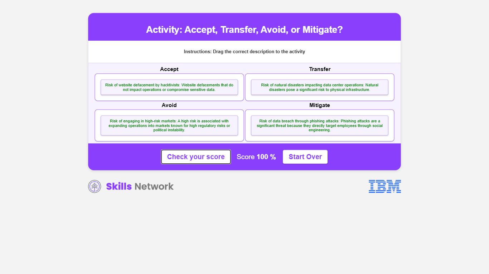

# Riesgo

## La gestión de riesgos

Consiste en identificar, evaluar y controlar los riesgos financieros, legales, estratégicos y de seguridad para el capital y las ganancias de una organización.

Estas amenazas o riesgos pueden provenir de diversas fuentes, como la incertidumbre financiera, las responsabilidades legales, los errores de gestión estratégica , los accidentes y los desastres naturales.

## Plan de Gestión de Riesgos

La **gestión de riesgos consiste** en combinar personas, hábitos y tecnología para garantizar que los objetivos de una empresa coincidan con sus valores y los riesgos a los que podría enfrentarse.

**Un buen plan de gestión de riesgos** sigue las reglas, se apega a los estándares y la ética de la empresa y se mantiene al día con las nuevas leyes tecnológicas.

Al **centrarse en encontrar y corregir los riesgos** y **asignar los recursos suficientes para detenerlos**, una empresa puede protegerse de las sorpresas, reducir los costos y aumentar sus posibilidades de seguir adelante y tener un buen desempeño.

**En ciberseguridad, la gestión de riesgos emplea los mismos principios fundamentales**, pero se centra en:

- Proteger los activos de información de una organización.

- Las ciberamenazas provienen de diversas fuentes, incluidos los ciberdelincuentes, las amenazas internas e incluso los actores patrocinados por el estado que se centran en las vulnerabilidades de los sistemas de tecnología de la información.

- La gestión eficaz de los riesgos de ciberseguridad implica identificar las posibles amenazas a los activos digitales, evaluar su probabilidad y posible impacto e implementar controles para mitigar estos riesgos.

## La identificación de riesgos

Es un primer paso fundamental en la gestión de riesgos, ya que **reconoce sistemáticamente los riesgos potenciales** que podrían amenazar los objetivos de una empresa. Esto implica identificar cuáles son estos riesgos y **comprender su origen y el impacto que podrían tener en las operaciones de una empresa**.

Los métodos efectivos de identificación de riesgos de ciberseguridad incluyen:

- Sesiones de intercambio de ideas.

- Consultas con expertos en ciberseguridad.

- Análisis de datos históricos de violaciones.

- Empleo de herramientas de software desarrolladas para descubrir posibles amenazas de seguridad.

## SWOT Analisis DOFA

Al analizar periódicamente las fortalezas, debilidades, oportunidades y amenazas, el análisis DOFA puede proporcionar una forma estructurada de descubrir los riesgos derivados tanto de las debilidades internas como de las amenazas externas.

Un análisis DOFA es un marco estratégico que se utiliza para evaluar la posición competitiva de una empresa mediante la identificación de sus fortalezas, debilidades, oportunidades y amenazas.

Este análisis es fundamental en la planificación estratégica, ya que ofrece información que ayuda a tomar decisiones informadas.

- Los **puntos fuertes** son los atributos de la empresa que ofrecen una ventaja en ciberseguridad, como las tecnologías de seguridad avanzadas, un equipo de ciberseguridad capacitado, un cifrado de datos sólido o herramientas de seguridad patentadas.

- Las **debilidades** son vulnerabilidades internas que podrían poner en peligro la ciberseguridad de una empresa, como el software de seguridad obsoleto, la capacitación insuficiente del personal , las políticas de contraseñas débiles o la falta de una estrategia integral de gestión de riesgos.

- Las **oportunidades** son factores externos que podrían mejorar la postura de ciberseguridad de una empresa, como la adopción de tecnologías de seguridad emergentes, las asociaciones con empresas de ciberseguridad, el aprovechamiento de la inteligencia artificial para la detección de amenazas o los cambios normativos que promuevan estándares de seguridad más estrictos.

- Las **amenazas** son riesgos externos para la ciberseguridad de una empresa, como los ciberataques sofisticados, las estafas de suplantación de identidad, los avances del malware o las implicaciones legales de las filtraciones de datos que podrían comprometer las operaciones comerciales.

## Evaluación de riesgos

El siguiente paso crucial en el proceso de gestión de riesgos es llevar a cabo una evaluación exhaustiva de los riesgos.

Esta fase implica la evaluación de los riesgos identificados para comprender la gravedad potencial y la probabilidad de que ocurran. Una evaluación de riesgos rigurosa permite a las organizaciones priorizar los riesgos y asignar los recursos de manera más eficaz para mitigar aquellos que representan la mayor amenaza para sus objetivos.

El proceso de evaluación de riesgos se puede clasificar en diferentes tipos según su aplicación y frecuencia.

- Las **evaluaciones ad hoc** se refieren a las evaluaciones de riesgos que se llevan a cabo según sea necesario, a menudo en respuesta a un evento inesperado o a un cambio repentino en el entorno externo o interno.

- Las **evaluaciones periódicas** se programan a intervalos regulares, mensuales, trimestrales o anuales, independientemente de la necesidad inmediata, lo que garantiza un monitoreo constante del panorama de riesgos. Se realizan evaluaciones únicas para proyectos o iniciativas específicos. Evalúan los riesgos relacionados con una acción o decisión en particular que no forma parte de las operaciones regulares.

- La **evaluación continua** es un proceso continuo que monitorea constantemente el entorno de riesgo y los indicadores de rendimiento para identificar nuevos riesgos a medida que surgen y evaluar la eficacia de las medidas de control en tiempo real.

## Priorización de Riesgo

La priorización de los riesgos es una fase crítica del proceso de gestión de riesgos en la que los riesgos identificados se clasifican en función de su impacto potencial en la organización y la probabilidad de que ocurran.

Priorizar los riesgos de ciberseguridad significa decidir cuidadosamente en qué centrarse para proteger las partes esenciales de una empresa. Esto incluye determinar qué tan grande es la amenaza de cada riesgo, cómo podría afectar a los activos más críticos de la empresa y cumplir con las leyes para evitar multas elevadas. También se trata de gastar el dinero de manera inteligente para obtener la mejor protección donde más se necesita. Este enfoque ayuda a garantizar la seguridad de la empresa y el cumplimiento eficiente de los requisitos legales.

## La tolerancia al riesgo y el apetito por el riesgo

Moldean significativamente las estrategias de gestión de riesgos de una empresa. La tolerancia al riesgo se refiere al nivel de riesgo que una empresa está dispuesta a soportar para lograr sus objetivos.

Por el contrario, el apetito por el riesgo es la cantidad de riesgo que la empresa está dispuesta a asumir para alcanzar sus objetivos. Estos conceptos pueden clasificarse en tres orientaciones principales.

- **Expansivo** significa un alto apetito por el riesgo, en el que una empresa está dispuesta a asumir riesgos sustanciales por la posibilidad de obtener recompensas significativas. Las organizaciones con una postura expansiva suelen estar en modos de crecimiento agresivos, buscando una rápida expansión y el dominio del mercado a costa de una vulnerabilidad potencialmente mayor.

- Un apetito de riesgo **conservador** indica un umbral de riesgo bajo en el que la estabilidad y la seguridad se priorizan por encima de los posibles altos rendimientos. Las empresas que adoptan esta postura hacen hincapié en la protección de los activos y en el mantenimiento de un crecimiento constante y reacio al riesgo.

- Las empresas con un apetito de riesgo **neutral** logran un equilibrio entre las estrategias de asunción y evitación de riesgos. Estas organizaciones buscan mantener un nivel moderado de riesgo que se alinee con su capacidad para administrar y mitigar las posibles amenazas de manera efectiva.

## Mitigación de Riesgo

Las organizaciones implementan varios métodos para abordar los riesgos identificados.

- La estrategia de **transferencia** implica trasladar el impacto potencial de un riesgo a un tercero, por ejemplo, mediante pólizas de seguro o la subcontratación. Se usa comúnmente para riesgos que escapan al control o la experiencia de la empresa.

- La **aceptación** del riesgo se produce cuando una empresa actúa a pesar de los riesgos identificados. Esto se puede dividir en dos categorías más:

  - **exención**, una asignación temporal por desviarse de los controles de riesgo estándar en condiciones específicas;

  - **excepción**, reconocimiento del riesgo sin planes de mitigación actuales, a menudo debido a los resultados del análisis de coste-beneficio;

- La **evitación** de riesgos implica cambiar los planes o estrategias para evadir por completo los riesgos potenciales; esto se aplica a los riesgos con impactos potencialmente devastadores que superan los beneficios de la acción perseguida;

- Las estrategias de **mitigación** tienen como objetivo reducir la probabilidad o el impacto de los riesgos a un nivel aceptable, esto puede incluir la implementación de protocolos de seguridad, la realización de capacitaciones periódicas, la actualización del software o la aplicación de políticas y procedimientos para gestionar las vulnerabilidades.

## Ejercicio

