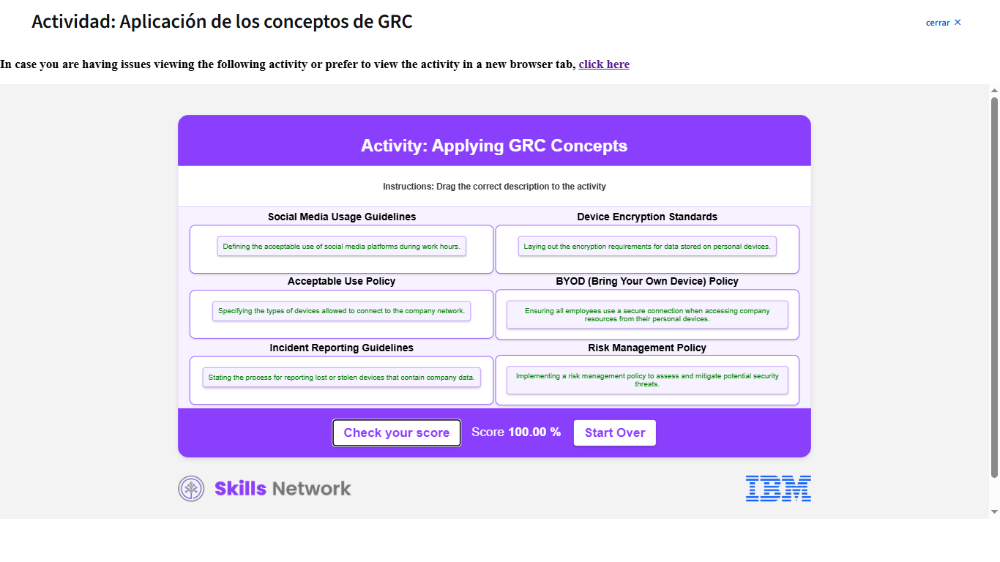

# Governance, Risk and Compliance (GRC)

GRC es un método integral para asegurar que la TI se **alinee con los objetivos comerciales, gestione los riesgos y cumpla con los requisitos normativos**, proporcionando directrices claras y procedimientos para un funcionamiento fluido.

---

## Componentes Clave de GRC

### 1. Gobernanza

- **Definición:** Establecer políticas y procedimientos para guiar la operación y la toma de decisiones.
- **Función:** Define objetivos, asigna roles y asegura la alineación con la misión.
- **Resultado:** Promueve la **responsabilidad, la transparencia** y el comportamiento ético.

### 2. Gestión de Riesgos

- **Definición:** Identificar, evaluar y abordar posibles amenazas (financieras, ciberseguridad, operativas).
- **Función:** Minimizar el impacto de eventos inesperados y proteger recursos.
- **Resultado:** Apoya la **toma de decisiones inteligentes**.

### 3. Cumplimiento

- **Definición:** Seguir todas las leyes, regulaciones, normas y políticas internas.
- **Función:** Operar legalmente y evitar problemas legales.
- **Resultado:** Mejora la **reputación y credibilidad**. Se mantiene con controles, auditorías y formación.

---

## Beneficios del Marco GRC

- **Integración:** Unifica actividades de gestión en un enfoque coherente, mejorando la eficacia de procesos y la toma de decisiones.
- **Ahorro de Costos:** Optimiza operaciones al eliminar redundancias.
- **Seguridad:** Aumenta la visibilidad de riesgos y amenazas, protegiendo la infraestructura.
- **Cumplimiento Continuo:** Evita sanciones financieras y acciones legales.
- **Eficiencia Operacional:** Reduce la duplicación de esfuerzos y automatiza tareas.
- **Confianza:** Fomenta la transparencia, generando confianza entre las partes interesadas.

---

## Limitaciones Potenciales

Una implementación deficiente puede generar:

- **Costos elevados** e ineficiencias sin beneficios.
- **Débil visibilidad de los riesgos**, aumentando vulnerabilidades.
- **Fragmentación** entre departamentos.

---

