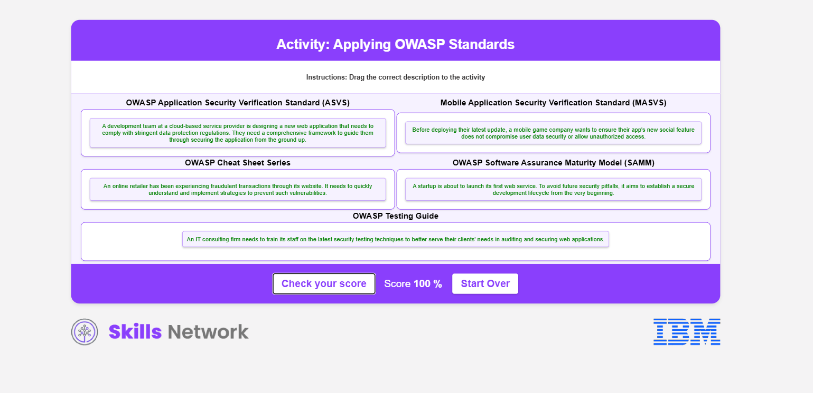

# Casos de uso de OWASP

## Estándares de OWASP

El Proyecto Abierto de Seguridad de Aplicaciones Web (OWASP) es una organización sin fines de lucro enfocada en hacer el software más seguro. Se inició el 1 de diciembre de 2001 y se convirtió en una organización sin fines de lucro oficial en EE. UU. el 21 de abril de 2004. OWASP trabaja ofreciendo recursos gratuitos como código, guías y estándares para ayudar en la creación y uso seguro del software. Tiene más de 250 grupos locales en todo el mundo y muchos miembros que comparten conocimientos y herramientas para el desarrollo seguro de software.

OWASP también organiza eventos educativos para enseñar a las personas sobre la seguridad de las aplicaciones. Sus recursos, como proyectos, herramientas, documentos y foros, son gratuitos, lo que facilita que cualquier persona interesada en la seguridad del software aprenda y ayude a hacer el mundo digital más seguro.

OWASP ha establecido varios estándares y recursos para mejorar la seguridad del software y las aplicaciones web. Entre estos, los más reconocidos incluyen:

- OWASP Top 10
- OWASP Application Security Verification Standard (ASVS)
- Mobile Application Security Verification Standard (MASVS)
- OWASP Software Assurance Maturity Model (SAMM)
- OWASP Testing Guide
- OWASP Cheat Sheet Series

## OWASP Top 10

El OWASP Top 10 es un documento ampliamente reconocido que describe los diez riesgos de seguridad de aplicaciones web más críticos, sirviendo como una guía para que desarrolladores y profesionales de seguridad entiendan y mitiguen las vulnerabilidades prevalentes. Cubre riesgos desde el control de acceso roto hasta ataques de inyección, fallos criptográficos y configuraciones de seguridad incorrectas. La lista se actualiza periódicamente para reflejar el panorama de amenazas en evolución. Enfatiza la importancia de prácticas de codificación segura, actualizaciones regulares de componentes de software y medidas de seguridad proactivas para proteger las aplicaciones web de la explotación. Comprender el OWASP Top 10 es esencial para cualquiera involucrado en el desarrollo o la seguridad de aplicaciones web, ya que proporciona una base para construir y mantener sistemas de software seguros.

## OWASP ASVS

El Estándar de Verificación de Seguridad de Aplicaciones de OWASP (ASVS) es un marco para evaluar la seguridad de aplicaciones y servicios web. Proporciona requisitos y controles de seguridad integrales que guían a desarrolladores y organizaciones en la creación y mantenimiento de aplicaciones seguras. El ASVS categoriza estos requisitos en diferentes niveles de garantía adaptados al perfil de riesgo de la aplicación y abarca una amplia gama de temas de seguridad, desde autenticación y gestión de sesiones hasta control de acceso y prácticas criptográficas. Al seguir las directrices del ASVS, las organizaciones pueden lograr una estrategia consistente y completa para la seguridad de aplicaciones, lo cual es crucial para expertos en TI y seguridad enfocados en proteger sus aplicaciones web de riesgos potenciales.

## OWASP MASVS

El Estándar de Verificación de Seguridad de Aplicaciones Móviles del Proyecto Abierto de Seguridad de Aplicaciones Web (OWASP MASVS) es un marco para establecer una línea base de seguridad para aplicaciones móviles. Proporciona un conjunto integral de requisitos de seguridad que los desarrolladores y evaluadores pueden seguir para garantizar que sus aplicaciones móviles sean seguras contra amenazas y vulnerabilidades comunes. El MASVS está estructurado en diferentes niveles de rigor de seguridad, lo que lo hace adaptable a varios escenarios de riesgo y tipos de aplicaciones, desde aquellas que manejan información altamente sensible hasta aplicaciones menos críticas. Este estándar tiene como objetivo guiar el desarrollo y la prueba seguros de aplicaciones móviles, asegurando que la seguridad no sea una reflexión tardía, sino una parte integral del ciclo de vida del desarrollo de la aplicación.

## OWASP SAMM

El Modelo de Madurez de Aseguramiento de Software de OWASP (SAMM) es un marco abierto diseñado para ayudar a las organizaciones a formular e implementar una estrategia de seguridad de software que se integre fácilmente en su Ciclo de Vida de Desarrollo de Software (SDLC) existente. Proporciona un camino estructurado para mejorar la postura de seguridad de las prácticas de software, independientemente del tamaño de la organización o del software que utilicen. SAMM ofrece un conjunto integral de prácticas de seguridad a través de diversas funciones comerciales, estructuradas en niveles de madurez que guían a las organizaciones desde prácticas iniciales y ad hoc hasta un programa de seguridad de software maduro, repetible y medible. Este modelo facilita todo el ciclo de vida del software y es adaptable a diversas tecnologías y procesos, sirviendo como un recurso flexible para la mejora continua en el aseguramiento de software.

## Guía de Pruebas de OWASP

La Guía de Pruebas de OWASP es un manual integral que proporciona un marco para la prueba de seguridad de aplicaciones y servicios web. Está diseñado para ayudar a las organizaciones a comprender e implementar un programa de pruebas sólido, ofreciendo una visión amplia de los elementos necesarios para un programa de seguridad de aplicaciones web completo. La guía es el resultado de esfuerzos colaborativos de profesionales de ciberseguridad y voluntarios, detallando las mejores prácticas para pruebas de penetración y otras evaluaciones de seguridad. Destaca una metodología científica repetible para las pruebas, asegurando que las aplicaciones web se sometan a una evaluación exhaustiva y sistemática de las vulnerabilidades de seguridad.

## Serie de Hojas de Trucos de OWASP

La Serie de Hojas de Trucos de OWASP es una colección de documentos concisos y de alto valor sobre diversos temas de seguridad en aplicaciones, creados por profesionales de seguridad experimentados. Estas hojas de trucos están diseñadas para proporcionar orientación de seguridad rápida y práctica en un formato fácilmente digerible, cubriendo una amplia gama de temas, desde codificación segura y prevención de inyecciones hasta mejores prácticas de autenticación y estándares criptográficos. Son un recurso fundamental para desarrolladores y profesionales de seguridad que buscan fortalecer su conocimiento en seguridad de aplicaciones e implementar medidas de seguridad robustas de manera eficiente. La serie contribuye a la dedicación de OWASP para mejorar la seguridad del software a través de materiales de código abierto, ayudando a los profesionales a mantenerse actualizados con las tácticas de seguridad más recientes.

## Conclusión

Estos estándares y recursos están diseñados para ser aplicados por cualquier persona involucrada en el ciclo de vida de una aplicación web, ya sea programando, diseñando o manteniendo estas aplicaciones, para mejorar su postura de seguridad y mitigar riesgos.

