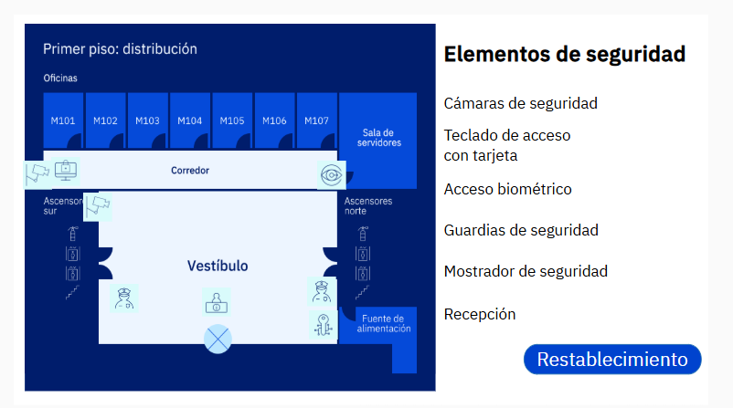

# Plan de Control y Seguridad Fisica

## Paso 1

Como miembro de un equipo de ciberseguridad, trabajas para una corporación que está licitando un contrato gubernamental. Toda la información confidencial debe permanecer en el sitio (onsite). Por lo tanto, el contrato prohíbe guardar información confidencial en unidades flash USB u otros dispositivos de almacenamiento extraíbles que puedan usarse para transportar archivos fuera de las instalaciones.

La corporación debe mejorar sus medidas de seguridad para prevenir este tipo de filtración de datos (data breach). Actualmente, la corporación cuenta con las siguientes medidas de seguridad:

- La sala de servidores está cerrada con llave. Cada miembro del personal de TI tiene una llave de la sala de servidores.

- La puerta de los espacios de trabajo compartidos no está cerrada con llave. Sin embargo, un letrero fuera de esta puerta indica claramente: "Solo personal autorizado", y una recepcionista examina a todos los visitantes.

- Todos los empleados tienen sus propios nombres de usuario y contraseñas.

- Se ha instruido a todos los empleados para que no conecten unidades flash USB o discos duros externos a sus computadoras de trabajo.

Tu supervisor te asigna la tarea de desarrollar un plan para cumplir con los requisitos del contrato. Inserta la imagen de tu plan a continuación.

## Paso 2

Identifica al menos tres nuevos controles físicos para implementar en el primer piso. Usa los controles y ubicaciones que elegiste en el paso 1.

1. Deshabilitaría los puertos USB de todos los dispositivos. Que solo el CTO y otro encargado puedan habilitarlo. Tener una política de que se llene un formulario cuando sea necesario realizar esta acción y llevar el login de cuando se active un puerto usb y utilizaria tapones usb para mas seguridad.

2. Implementar el uso obligatorio del carné o identificación en lugar visible para que los guardias puedan filtrar el acceso a las área restringida de una manera que no interfiera con el flujo de personal.

3. Colocar controles de acceso a la oficina ya sea con tarjetas magnéticas o datos biométricos.

## Paso 3

Identifica tres controles ambientales para implementar en el primer piso. Estos controles deben minimizar la pérdida de datos valiosos en caso de incendio, desastre natural o fallo eléctrico. Explica tu razonamiento para cada elección.

1. Sistema detector de incendio que incluya detectores de humo, se puede usar rociadores en el lobby, tener extintores en el lobby y en el pasillo de las oficinas. Pero en las oficinas que sea del tipo que es para equipos electrónicos. Igual que el rociador de la sala de servidores no puede ser de agua ya que dañaría los equipos que se encuentren en esa zona deben ser de la espuma que se usa para apagar incendios en dispositivos electrónicos.

2. Lo ideal sería tener redundancia en el servicio eléctrico pero de no ser posible, tener una planta de emergencia con UPS (Sistema de Alimentación Ininterrumpida) para los equipos es una forma de asegurar que los equipos se apaguen correctamente mientras se restablece el servicio.

3. El cuarto de servidores debe constar con sensores y aires de precision para controlar la temperatura y la humedad en la sala para alargar la vida util y mejorar la eficiencia de trabajo de los equipos.
