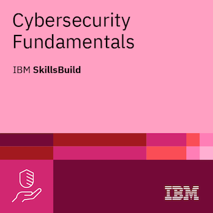
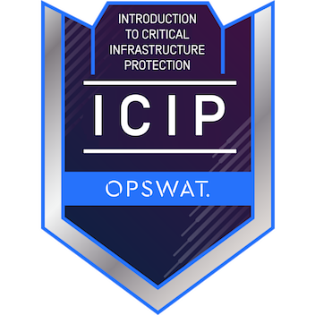
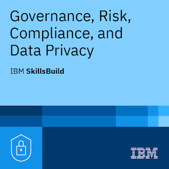

# 🛡️ Repositorio de Ciberseguridad: Daniel Jiménez

> Este repositorio sirve como mi portafolio, cuaderno de notas y centro de recursos para mi viaje en Ciberseguridad. Documento aquí mi aprendizaje, retos completados y la aplicación práctica de mis conocimientos.

---

## ⚠️ Descargo de Responsabilidad (Disclaimer)

> **Aviso:** Los documentos de ejercicios, retos y análisis aquí contenidos pertenecen al curso **Certificado de Ciberseguridad de IBM SkillsBuild** y son utilizados con fines exclusivamente **educativos y de portafolio**, con el objetivo de demostrar la aplicación de conocimientos técnicos. Se respeta en todo momento la propiedad intelectual de IBM y los autores originales.

---

## 🏆 Certificaciones e Insignias (Credly/Certificados)

¡Aquí están mis credenciales verificadas que demuestran mi compromiso con el aprendizaje continuo y mi dominio de los fundamentos de Ciberseguridad!

| Insignia | Certificación | Plataforma | Fecha de Emisión | Enlace de Verificación |
| :---: | :--- | :--- | :--- | :--- |
|  | **Certificado de Ciberseguridad de Google** | Google / Coursera | 18 de Febrero, 2025 | [Ver en Credly](https://www.credly.com/earner/earned/badge/bb3cf624-caac-40e2-88d4-c5143a73fa5d) |
|  | **Cybersecurity Fundamentals** | IBM SkillsBuild | 25 de Marzo, 2025 | [Ver en Credly](https://www.credly.com/earner/earned/badge/492722b6-67f9-4227-8708-545c39e70e0e) |
|  | **OPSWAT: Intro. a Protección de Infraestructura Crítica (ICIP)** | OPSWAT | 05 de Diciembre, 2024 | [Ver en Credly](https://www.credly.com/earner/earned/badge/8294ab98-8b32-4a27-9fd8-7375962e956c) |
|  | **Governance, Risk, Compliance, and Data Privacy** | IBM SkillsBuild | 22 de Octubre, 2025 | [Ver en Credly](https://www.credly.com/earner/earned/badge/f76ec954-d7d8-4d76-90a4-cb4e3a6c7986) |

---

## 📚 Estructura del Repositorio

| Directorio | Contenido | Objetivo |
| :--- | :--- | :--- |
| **`Datos/`** | **Notas teóricas** y resúmenes de módulos. (Ej. Triada CIA, Controles de Seguridad). | Documentar el conocimiento teórico y fundamental. |
| **`Gobernanza _Riesgo_Cumplimineto(GRC)`** | **Gobernanza, Riesgo, Cumplimiento y Privacidad de Datos (GRC)**. | Contiene los archivos sobre la estructura legal, riesgos y cumplimiento. |
| **`Herramientas/`** |**Archivos Markdown detallando el uso y análisis de herramientas de seguridad** (Ej. rkhunter.md).|Demostrar la experiencia práctica y el dominio en el manejo de utilidades de ciberseguridad.|
| **`Docs/`** | **Documentación de Cursos y Plantillas Formales**. (Ej. Guías de compliance, formatos de cursos). | Servir como un repositorio de documentación formal y estándares. |
| **`Docs/Mis respuestas/`** | **Ejercicios de documentación llenados** (respuestas a plantillas). | Demostrar la capacidad de aplicar marcos en escenarios reales. |
| **`images/badge/`** | Archivos de imagen para las insignias y certificaciones. | Soporte visual para la sección de Certificaciones. |

---

## 🧭 Navegación Detallada

Para una visión completa y enlaces directos a todo el contenido del repositorio (notas, conceptos y ejercicios de aplicación), consulta el índice en:

* **[Índice Completo de Contenido (Próximamente HTML)]**
* [**README.md** dentro de la carpeta `datos/`](datos/README.md)
* [**README.md** dentro de la carpeta `docs/`](docs/README.md)

---

## 📧 Contacto

Conéctate conmigo para discutir proyectos, oportunidades laborales o simplemente compartir conocimiento en ciberseguridad.

* **LinkedIn:** [Daniel Jiménez](https://www.linkedin.com/in/daniel-jimenez-88a2a293/)

---

## 📝 Licencia

Este repositorio se distribuye bajo la Licencia **MIT**. [Ver archivo `LICENSE` para más detalles.](LICENSE)