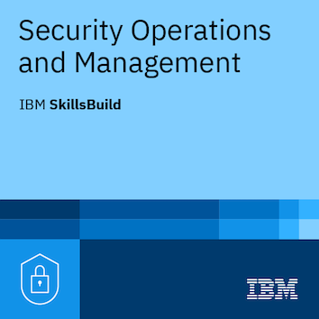
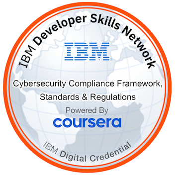
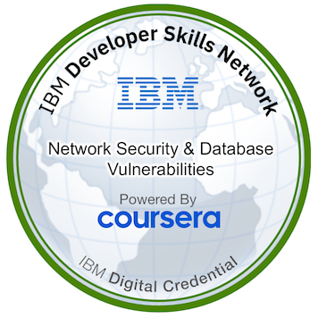

# 🛡️ Repositorio de Ciberseguridad: Daniel Jiménez

> Este repositorio sirve como mi portafolio, cuaderno de notas y centro de recursos para mi viaje en Ciberseguridad. Documento aquí mi aprendizaje, retos completados y la aplicación práctica de mis conocimientos.

---

## ⚠️ Descargo de Responsabilidad (Disclaimer)

> **Aviso:** Los documentos de ejercicios, retos y análisis aquí contenidos pertenecen al curso **Certificado de Ciberseguridad de IBM SkillsBuild** y son utilizados con fines exclusivamente **educativos y de portafolio**, con el objetivo de demostrar la aplicación de conocimientos técnicos. Se respeta en todo momento la propiedad intelectual de IBM y los autores originales.

---

## 🏆 Certificaciones e Insignias

### 🥇 Certificado de Ciberseguridad de Google

|                                                            Insignia                                                             | Certificación                                                    | Plataforma        | Fecha de Emisión        | Enlace de Verificación                                                                           |
| :-----------------------------------------------------------------------------------------------------------------------------: | :--------------------------------------------------------------- | :---------------- | :---------------------- | :----------------------------------------------------------------------------------------------- |
|                                       | **Certificado de Ciberseguridad de Google**                      | Google / Coursera | 18 de Febrero, 2025     | [Ver en Credly](https://www.credly.com/earner/earned/badge/bb3cf624-caac-40e2-88d4-c5143a73fa5d) |
|                            | Fundamentos de la ciberseguridad                                 | Google / Coursera | 29 de octubre de 2024   | [Ver certificado](https://coursera.org/verify/ZL1EU6W0UWU8)                                      |
|                    | Ve a lo seguro: Gestiona los riesgos de seguridad                | Google / Coursera | 13 de noviembre de 2024 | [Ver certificado](https://www.coursera.org/verify/ASQO7VLQ9BH1)                                  |
|               | Conexión y protección: Redes y seguridad de redes                | Google / Coursera | 24 de noviembre de 2024 | [Ver certificado](https://www.coursera.org/account/accomplishments/verify/SKTFWD2U1OLX)          |
|                              | Herramientas del oficio: Linux y SQL                             | Google / Coursera | 1 de diciembre de 2024  | [Ver certificado](https://www.coursera.org/account/accomplishments/verify/DBSK9THDK2TE)          |
|                    | Activos, amenazas y vulnerabilidades                             | Google / Coursera | 21 de diciembre de 2024 | [Ver certificado](https://www.coursera.org/account/accomplishments/verify/X0B74VFTWMRD)          |
|                          | Haz sonar la alarma: Detección y respuesta                       | Google / Coursera | 1 de febrero de 2025    | [Ver certificado](https://www.coursera.org/account/accomplishments/verify/X3G7TCQ9QD62)          |
|               | Automatiza las tareas de ciberseguridad con Python               | Google / Coursera | 17 de febrero de 2025   | [Ver certificado](https://www.coursera.org/account/accomplishments/verify/8MPWSXKFH1P7)          |
|  | Ponlo en práctica: Prepárate para los trabajos en ciberseguridad | Google / Coursera | 18 de febrero de 2025   | [Ver certificado](https://www.coursera.org/account/accomplishments/verify/80XQ45CS6DYZ)          |

---

### 🥈 Certificado de Ciberseguridad de IBM SkillsBuild

**Estado:** ⏳ **En Progreso** (5 de 6 Microcredenciales obtenidas)

|                                          Insignia                                          | Certificación                                      | Plataforma      | Fecha de Emisión      | Enlace de Verificación                                                                           |
| :----------------------------------------------------------------------------------------: | :------------------------------------------------- | :-------------- | :-------------------- | :----------------------------------------------------------------------------------------------- |
|           | **Governance, Risk, Compliance, and Data Privacy** | IBM SkillsBuild | 22 de Octubre, 2025   | [Ver en Credly](https://www.credly.com/earner/earned/badge/f76ec954-d7d8-4d76-90a4-cb4e3a6c7986) |
|             | **Vulnerability Management**                       | IBM SkillsBuild | 12 de Noviembre, 2025 | [Ver en Credly](https://www.credly.com/badges/89ae4c2d-9574-47b5-9917-6717a79170db/public_url)   |
|                | **System and Network Security**                    | IBM SkillsBuild | 22 de Noviembre, 2025 | [Ver en Credly](https://www.credly.com/badges/33ca6b26-b80f-4de3-ad80-d6852152d605/public_url)   |
|                                          | **Cloud Security**                                 | IBM SkillsBuild | 25 de Noviembre, 2025 | [Ver en Credly](https://www.credly.com/badges/b186f67b-d9c6-48bf-abe8-802760fb95a0/public_url)   |
|  | **Security Operations and Management**             | IBM SkillsBuild | 01 de Diciembre, 2025 | [Ver en Credly](https://www.credly.com/badges/46236b14-56be-4bd7-86c8-2ba5f41dedc1/public_url)   |

---

### 🥈 Certificado profesional de Analista de ciberseguridad de IBM

**Estado:** ⏳ **En Progreso** (4 de 14 cursos)

|                                                                   Insignia                                                                    | Certificación                                                   | Plataforma   | Fecha de Emisión      | Enlace de Verificación                                                                         |
| :-------------------------------------------------------------------------------------------------------------------------------------------: | :-------------------------------------------------------------- | :----------- | :-------------------- | :--------------------------------------------------------------------------------------------- |
|                           | **Introduction to Cybersecurity Tools and Cyberattack**         | IBM Coursera | 02 de Noviembre, 2025 | [Ver en Credly](https://www.credly.com/badges/1e9f4f76-a0d3-4e91-acb9-57d2434ca5d3/public_url) |
|                                   | **Operating Systems Overview: Administration and Security**     | IBM Coursera | 21 de Noviembre, 2025 | [Ver en Credly](https://www.credly.com/badges/26070355-58c7-4f09-8f3a-b89fbbd42732/public_url) |
|  | **Cybersecurity Compliance Framework, Standards & Regulations** | IBM Coursera | 14 de Diciembre, 2025 | [Ver en Credly](https://www.credly.com/badges/2b1456a5-7455-4078-8329-4c389bafd6fa/public_url) |
|                            | **Network Security & Database Vulnerabilities**                 | IBM Coursera | 18 de Diciembre, 2025 | [Ver en Credly](https://www.credly.com/badges/109a151c-1701-4365-972c-889a1cf12f18/public_url) |

---

¡Otras credenciales

|                                                     Insignia                                                     | Certificación                                                     | Plataforma                   | Fecha de Emisión      | Enlace de Verificación                                                                           |
| :--------------------------------------------------------------------------------------------------------------: | :---------------------------------------------------------------- | :--------------------------- | :-------------------- | :----------------------------------------------------------------------------------------------- |
|                               | **Cybersecurity Fundamentals**                                    | IBM SkillsBuild              | 25 de Marzo, 2025     | [Ver en Credly](https://www.credly.com/earner/earned/badge/492722b6-67f9-4227-8708-545c39e70e0e) |
|          | **OPSWAT: Intro. a Protección de Infraestructura Crítica (ICIP)** | OPSWAT                       | 05 de Diciembre, 2024 | [Ver en Credly](https://www.credly.com/earner/earned/badge/8294ab98-8b32-4a27-9fd8-7375962e956c) |
|  | **Insignia de finalización de Cybersecurity**                     | U.S.-ASEAN Center y Coursera | 17 de Diciembre, 2025 | [Ver en Coursera](https://coursera.org/share/f59f04ba6e45debf37b16592506940e6)                   |

---

## 📚 Estructura del Repositorio

| Directorio                                                          | Contenido Actual                                                                                                             | Objetivo y Contexto                                                                                     |
| :------------------------------------------------------------------ | :--------------------------------------------------------------------------------------------------------------------------- | :------------------------------------------------------------------------------------------------------ |
| **`Certificado de ciberseguridad de IBM SkillsBuild/`**             | Módulos del curso, como **Operaciones y Gestión de Seguridad** (`Módulo 9`, `Módulo 10`).                                    | Contiene notas detalladas y ejercicios de los módulos para obtener la certificación de IBM SkillsBuild. |
| **`Certificado profesional de Analista de ciberseguridad de IBM/`** | Módulos del curso, como **Marco de cumplimiento de la ciberseguridad, normas y reglamentos**.                                | Recopila la documentación de los cursos de la certificación profesional de IBM.                         |
| **`Seguridad cibernética coursera/`**                               | Módulos de cursos de **Cumplimiento, Estándares y Regulaciones** de Coursera.                                                | Documenta el material de otros cursos externos relevantes para la ciberseguridad.                       |
| **`Docs/`**                                                         | Repositorio de documentación de cursos específicos, como **Microcredenciales 3 y 4** de IBM, y carpetas de `Mis respuestas`. | Almacena plantillas de ejercicios, respuestas formales y documentación organizada por curso/módulo.     |
| **`Docs/Mis respuestas/`**                                          | Documentos de texto con respuestas detalladas a plantillas de ejercicios de varios cursos.                                   | Demuestra la **capacidad de aplicación** de conceptos en escenarios de documentación formal.            |
| **`Sistemas Operativos/`**                                          | Notas y archivos relacionados con sistemas operativos, específicamente la subcarpeta `windows`.                              | Documenta el conocimiento sobre la administración y seguridad de los sistemas operativos.               |
| **`Herramientas/`**                                                 | Archivos y notas sobre el uso práctico de herramientas de ciberseguridad.                                                    | Demuestra la experiencia práctica en el manejo de utilidades.                                           |
| **`Amenazas_y_Vulnerabilidades`**                                   | Archivos teóricos sobre identificación, análisis y mitigación de amenazas y vulnerabilidades.                                | Conocimiento transversal fundamental.                                                                   |
| **`Gobernanza _Riesgo_Cumplimineto(GRC)`**                          | Archivos y notas relacionadas con conceptos de GRC.                                                                          | Conocimiento transversal de la estructura legal y de riesgos.                                           |
| **`images/badge/`**                                                 | Archivos de imagen para todas las insignias y certificaciones.                                                               | Soporte visual para la sección de Certificaciones.                                                      |

---

## 📝 Nota sobre la Evolución de la Estructura del Repositorio

> **Contexto de Reorganización (Inicio: Diciembre de 2025):**
>
> Inicialmente, el conocimiento se organizó por temas teóricos y funcionales generales (ej., `Datos`, `GRC`). Sin embargo, reconociendo la necesidad de una estructura más clara y demostrable, la organización ha evolucionado hacia un enfoque basado en el **programa de estudios** o **curso certificado** (ej., `Certificado de ciberseguridad de IBM SkillsBuild`).
>
> Aunque la lista de directorios anterior aún refleja carpetas de la estructura inicial (como `Datos/` y `Gobernanza _Riesgo_Cumplimineto(GRC)`), actualmente se está priorizando la **documentación bajo la nueva estructura de cursos**. Próximamente se trabajará en estandarizar y migrar todo el contenido antiguo a la nueva estructura basada en certificaciones.

---

## 🧭 Navegación Detallada

Para una visión completa y enlaces directos a todo el contenido del repositorio (notas, conceptos y ejercicios de aplicación), consulta el índice en:

- **[Índice Completo de Contenido (Próximamente HTML)]**
- [**README.md** dentro de la carpeta `datos/`](datos/README.md)
- [**README.md** dentro de la carpeta `docs/`](docs/README.md)

---

## 📧 Contacto

Conéctate conmigo para discutir proyectos, oportunidades laborales o simplemente compartir conocimiento en ciberseguridad.

- **LinkedIn:** [Daniel Jiménez](https://www.linkedin.com/in/daniel-jimenez-88a2a293/)

---

## 📝 Licencia

Este repositorio se distribuye bajo la Licencia **MIT**. [Ver archivo `LICENSE` para más detalles.](LICENSE)
