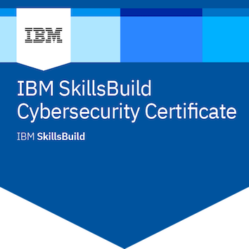
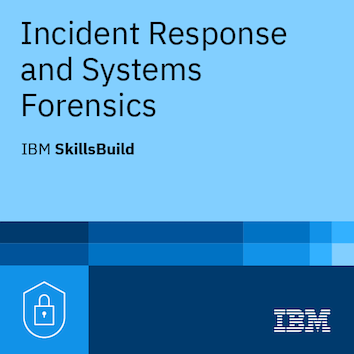
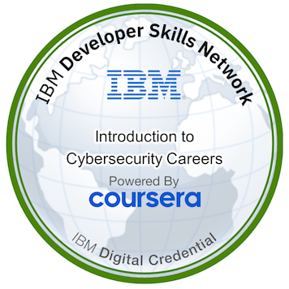

# 🛡️ Repositorio de Ciberseguridad: Daniel Jiménez

> Este repositorio sirve como mi portafolio, cuaderno de notas y centro de recursos para mi viaje en Ciberseguridad. Documento aquí mi aprendizaje, retos completados y la aplicación práctica de mis conocimientos.

---

## ⚠️ Descargo de Responsabilidad (Disclaimer)

> **Aviso:** Los documentos de ejercicios, retos y análisis aquí contenidos pertenecen al curso **Certificado de Ciberseguridad de IBM SkillsBuild** y son utilizados con fines exclusivamente **educativos y de portafolio**, con el objetivo de demostrar la aplicación de conocimientos técnicos. Se respeta en todo momento la propiedad intelectual de IBM y los autores originales.

---

## 🏆 Certificaciones e Insignias

### 🥇 Certificado de Ciberseguridad de Google

|                                                            Insignia                                                             | Certificación                                                    | Plataforma        | Fecha de Emisión        | Enlace de Verificación                                                                           |
| :-----------------------------------------------------------------------------------------------------------------------------: | :--------------------------------------------------------------- | :---------------- | :---------------------- | :----------------------------------------------------------------------------------------------- |
|                                       | **Certificado de Ciberseguridad de Google**                      | Google / Coursera | 18 de Febrero, 2025     | [Ver en Credly](https://www.credly.com/earner/earned/badge/bb3cf624-caac-40e2-88d4-c5143a73fa5d) |
|                            | Fundamentos de la ciberseguridad                                 | Google / Coursera | 29 de octubre de 2024   | [Ver certificado](https://coursera.org/verify/ZL1EU6W0UWU8)                                      |
|                    | Ve a lo seguro: Gestiona los riesgos de seguridad                | Google / Coursera | 13 de noviembre de 2024 | [Ver certificado](https://www.coursera.org/verify/ASQO7VLQ9BH1)                                  |
|               | Conexión y protección: Redes y seguridad de redes                | Google / Coursera | 24 de noviembre de 2024 | [Ver certificado](https://www.coursera.org/account/accomplishments/verify/SKTFWD2U1OLX)          |
|                              | Herramientas del oficio: Linux y SQL                             | Google / Coursera | 1 de diciembre de 2024  | [Ver certificado](https://www.coursera.org/account/accomplishments/verify/DBSK9THDK2TE)          |
|                    | Activos, amenazas y vulnerabilidades                             | Google / Coursera | 21 de diciembre de 2024 | [Ver certificado](https://www.coursera.org/account/accomplishments/verify/X0B74VFTWMRD)          |
|                          | Haz sonar la alarma: Detección y respuesta                       | Google / Coursera | 1 de febrero de 2025    | [Ver certificado](https://www.coursera.org/account/accomplishments/verify/X3G7TCQ9QD62)          |
|               | Automatiza las tareas de ciberseguridad con Python               | Google / Coursera | 17 de febrero de 2025   | [Ver certificado](https://www.coursera.org/account/accomplishments/verify/8MPWSXKFH1P7)          |
|  | Ponlo en práctica: Prepárate para los trabajos en ciberseguridad | Google / Coursera | 18 de febrero de 2025   | [Ver certificado](https://www.coursera.org/account/accomplishments/verify/80XQ45CS6DYZ)          |

---

### 🥈 Certificado de Ciberseguridad de IBM SkillsBuild

**Estado:** ✅ **Completado** (Diciembre 2025)
https://www.credly.com/badges/dab0b14a-b6ee-4495-85cc-861aec49c47d/public_url

|                                                 Insignia                                                 | Certificación                                      | Plataforma      | Fecha de Emisión      | Enlace de Verificación                                                                           |
| :------------------------------------------------------------------------------------------------------: | :------------------------------------------------- | :-------------- | :-------------------- | :----------------------------------------------------------------------------------------------- |
|  | **IBM SkillsBuild Cybersecurity Certificate**      | IBM SkillsBuild | 27 de Diciembre, 2025 | [Ver en Credly](https://www.credly.com/badges/dab0b14a-b6ee-4495-85cc-861aec49c47d/public_url)   |
|                         | **Governance, Risk, Compliance, and Data Privacy** | IBM SkillsBuild | 22 de Octubre, 2025   | [Ver en Credly](https://www.credly.com/earner/earned/badge/f76ec954-d7d8-4d76-90a4-cb4e3a6c7986) |
|                           | **Vulnerability Management**                       | IBM SkillsBuild | 12 de Noviembre, 2025 | [Ver en Credly](https://www.credly.com/badges/89ae4c2d-9574-47b5-9917-6717a79170db/public_url)   |
|                              | **System and Network Security**                    | IBM SkillsBuild | 22 de Noviembre, 2025 | [Ver en Credly](https://www.credly.com/badges/33ca6b26-b80f-4de3-ad80-d6852152d605/public_url)   |
|                                                        | **Cloud Security**                                 | IBM SkillsBuild | 25 de Noviembre, 2025 | [Ver en Credly](https://www.credly.com/badges/b186f67b-d9c6-48bf-abe8-802760fb95a0/public_url)   |
|                | **Security Operations and Management**             | IBM SkillsBuild | 01 de Diciembre, 2025 | [Ver en Credly](https://www.credly.com/badges/46236b14-56be-4bd7-86c8-2ba5f41dedc1/public_url)   |
|      | **Incident Response and Systems Forensics**        | IBM SkillsBuild | 25 de Diciembre, 2025 | [Ver en Credly](https://www.credly.com/badges/d74494fa-ce58-4991-ab50-3dc104736eea/public_url)   |

---

### 🥈 Certificado profesional de Analista de ciberseguridad de IBM

**Estado:** ⏳ **En Progreso** (5 de 14 cursos)

|                                                                   Insignia                                                                    | Certificación                                                   | Plataforma   | Fecha de Emisión      | Enlace de Verificación                                                                         |
| :-------------------------------------------------------------------------------------------------------------------------------------------: | :-------------------------------------------------------------- | :----------- | :-------------------- | :--------------------------------------------------------------------------------------------- |
|                                      | **Introduction to Cybersecurity Careers**                       | IBM Coursera | 01 de Enero, 2026     | [Ver en Credly](https://www.credly.com/badges/76e0f6a4-60b1-42e7-9ef9-d546201c9501/public_url) |
|                           | **Introduction to Cybersecurity Tools and Cyberattack**         | IBM Coursera | 02 de Noviembre, 2025 | [Ver en Credly](https://www.credly.com/badges/1e9f4f76-a0d3-4e91-acb9-57d2434ca5d3/public_url) |
|                                   | **Operating Systems Overview: Administration and Security**     | IBM Coursera | 21 de Noviembre, 2025 | [Ver en Credly](https://www.credly.com/badges/26070355-58c7-4f09-8f3a-b89fbbd42732/public_url) |
|  | **Cybersecurity Compliance Framework, Standards & Regulations** | IBM Coursera | 14 de Diciembre, 2025 | [Ver en Credly](https://www.credly.com/badges/2b1456a5-7455-4078-8329-4c389bafd6fa/public_url) |
|                            | **Network Security & Database Vulnerabilities**                 | IBM Coursera | 18 de Diciembre, 2025 | [Ver en Credly](https://www.credly.com/badges/109a151c-1701-4365-972c-889a1cf12f18/public_url) |

---

¡Otras credenciales

|                                                     Insignia                                                     | Certificación                                                     | Plataforma                   | Fecha de Emisión      | Enlace de Verificación                                                                           |
| :--------------------------------------------------------------------------------------------------------------: | :---------------------------------------------------------------- | :--------------------------- | :-------------------- | :----------------------------------------------------------------------------------------------- |
|                               | **Cybersecurity Fundamentals**                                    | IBM SkillsBuild              | 25 de Marzo, 2025     | [Ver en Credly](https://www.credly.com/earner/earned/badge/492722b6-67f9-4227-8708-545c39e70e0e) |
|          | **OPSWAT: Intro. a Protección de Infraestructura Crítica (ICIP)** | OPSWAT                       | 05 de Diciembre, 2024 | [Ver en Credly](https://www.credly.com/earner/earned/badge/8294ab98-8b32-4a27-9fd8-7375962e956c) |
|  | **Insignia de finalización de Cybersecurity**                     | U.S.-ASEAN Center y Coursera | 17 de Diciembre, 2025 | [Ver en Coursera](https://coursera.org/share/f59f04ba6e45debf37b16592506940e6)                   |

---

## 📚 Estructura del Repositorio

| Directorio                                                          | Contenido Actual                                                                                                             | Objetivo y Contexto                                                                                     |
| :------------------------------------------------------------------ | :--------------------------------------------------------------------------------------------------------------------------- | :------------------------------------------------------------------------------------------------------ |
| **`Certificado de ciberseguridad de IBM SkillsBuild/`**             | Módulos del curso, como **Operaciones y Gestión de Seguridad** (`Módulo 9`, `Módulo 10`).                                    | Contiene notas detalladas y ejercicios de los módulos para obtener la certificación de IBM SkillsBuild. |
| **`Certificado profesional de Analista de ciberseguridad de IBM/`** | Módulos del curso, como **Marco de cumplimiento de la ciberseguridad, normas y reglamentos**.                                | Recopila la documentación de los cursos de la certificación profesional de IBM.                         |
| **`Seguridad cibernética coursera/`**                               | Módulos de cursos de **Cumplimiento, Estándares y Regulaciones** de Coursera.                                                | Documenta el material de otros cursos externos relevantes para la ciberseguridad.                       |
| **`Docs/`**                                                         | Repositorio de documentación de cursos específicos, como **Microcredenciales 3 y 4** de IBM, y carpetas de `Mis respuestas`. | Almacena plantillas de ejercicios, respuestas formales y documentación organizada por curso/módulo.     |
| **`Docs/Mis respuestas/`**                                          | Documentos de texto con respuestas detalladas a plantillas de ejercicios de varios cursos.                                   | Demuestra la **capacidad de aplicación** de conceptos en escenarios de documentación formal.            |
| **`Sistemas Operativos/`**                                          | Notas y archivos relacionados con sistemas operativos, específicamente la subcarpeta `windows`.                              | Documenta el conocimiento sobre la administración y seguridad de los sistemas operativos.               |
| **`Herramientas/`**                                                 | Archivos y notas sobre el uso práctico de herramientas de ciberseguridad.                                                    | Demuestra la experiencia práctica en el manejo de utilidades.                                           |
| **`Amenazas_y_Vulnerabilidades`**                                   | Archivos teóricos sobre identificación, análisis y mitigación de amenazas y vulnerabilidades.                                | Conocimiento transversal fundamental.                                                                   |
| **`Gobernanza _Riesgo_Cumplimineto(GRC)`**                          | Archivos y notas relacionadas con conceptos de GRC.                                                                          | Conocimiento transversal de la estructura legal y de riesgos.                                           |
| **`images/badge/`**                                                 | Archivos de imagen para todas las insignias y certificaciones.                                                               | Soporte visual para la sección de Certificaciones.                                                      |

---

## 📝 Nota sobre la Evolución de la Estructura del Repositorio

> **Contexto de Reorganización (Inicio: Diciembre de 2025):**
>
> Inicialmente, el conocimiento se organizó por temas teóricos y funcionales generales (ej., `Datos`, `GRC`). Sin embargo, reconociendo la necesidad de una estructura más clara y demostrable, la organización ha evolucionado hacia un enfoque basado en el **programa de estudios** o **curso certificado** (ej., `Certificado de ciberseguridad de IBM SkillsBuild`).
>
> Aunque la lista de directorios anterior aún refleja carpetas de la estructura inicial (como `Datos/` y `Gobernanza _Riesgo_Cumplimineto(GRC)`), actualmente se está priorizando la **documentación bajo la nueva estructura de cursos**. Próximamente se trabajará en estandarizar y migrar todo el contenido antiguo a la nueva estructura basada en certificaciones.

---

## 📊 Mapa de Competencias Técnicas (Basado en Evidencia)

Este mapa detalla mis capacidades actuales tras completar las microcredenciales de **IBM SkillsBuild**, estructuradas en los 6 pilares fundamentales de mi formación.

### 1. 🛡️ Datos y Privacidad

| Competencia               | Nivel de Aplicación   | Evidencia Práctica                                                                 |
| :------------------------ | :-------------------- | :--------------------------------------------------------------------------------- |
| **Privacidad de Datos**   | **Sólido / Teórico**  | Clasificación de datos confidenciales y aplicación de mejores prácticas (PII/PHI). |
| **Criptografía Práctica** | **Práctica en Lab**   | Cifrado/descifrado de texto; uso de criptografía simétrica y asimétrica.           |
| **Modelo CIA Triad**      | **Conceptual Sólido** | Aplicación de Confidencialidad, Integridad y Disponibilidad a activos críticos.    |

### 2. ⚖️ Gobernanza, Riesgo y Cumplimiento (GRC)

| Competencia               | Nivel de Aplicación  | Evidencia Práctica                                                        |
| :------------------------ | :------------------- | :------------------------------------------------------------------------ |
| **Marcos de Gobernanza**  | **Sólido / Teórico** | Diferenciación entre políticas, estándares, directrices y procedimientos. |
| **Evaluación de Riesgos** | **Práctica en Lab**  | Análisis de impacto y determinación de niveles de tolerancia al riesgo.   |
| **Cumplimiento Legal**    | **Práctica en Lab**  | Auditoría de posturas de seguridad bajo estándares como **HIPAA**.        |

### 3. 🔍 Amenazas y Vulnerabilidades

| Competencia               | Nivel de Aplicación  | Evidencia Práctica                                                          |
| :------------------------ | :------------------- | :-------------------------------------------------------------------------- |
| **Mitigación de Malware** | **Práctica en Lab**  | Uso de **Malwarebytes** para detección y eliminación de software malicioso. |
| **Ingeniería Social**     | **Sólido / Teórico** | Identificación de tácticas de Phishing y vectores de ataque humano.         |
| **Seguridad Física**      | **Práctica en Lab**  | Diseño de planes de control físico (biometría, CCTV) y ambiental (CO2/UPS). |

### 4. 🛠️ Gestión de Vulnerabilidades

| Competencia                  | Nivel de Aplicación  | Evidencia Práctica                                                          |
| :--------------------------- | :------------------- | :-------------------------------------------------------------------------- |
| **Inteligencia de Amenazas** | **Sólido / Teórico** | Uso de **IBM X-Force** y lenguaje **STIX** para el análisis de incidentes.  |
| **Ciclo de Vulnerabilidad**  | **Práctica en Lab**  | Proceso de identificación, análisis, priorización y corrección de brechas.  |
| **Pentesting Básico**        | **Práctica en Lab**  | Escaneo de aplicaciones web para identificar fallos mediante **OWASP ZAP**. |

### 5. 💻 Seguridad del Sistema

| Competencia                   | Nivel de Aplicación | Evidencia Práctica                                                                   |
| :---------------------------- | :------------------ | :----------------------------------------------------------------------------------- |
| **Hardening de SO**           | **Práctica en Lab** | Aseguramiento de sistemas operativos host, servidores y bases de datos.              |
| **Seguridad de Firmware**     | **Práctica en Lab** | Mantenimiento crítico y actualización de firmware para mitigar exploits de hardware. |
| **Protección de Datos Cloud** | **Práctica en Lab** | Implementación de **CASB** y **CSPM** para visibilidad y cumplimiento en la nube.    |

### 6. 🌐 Seguridad de Red

| Competencia                   | Nivel de Aplicación | Evidencia Práctica                                                             |
| :---------------------------- | :------------------ | :----------------------------------------------------------------------------- |
| **Arquitectura de Red**       | **Práctica en Lab** | Diseño de infraestructuras seguras con segmentación y dispositivos de defensa. |
| **Controles de Acceso (NAC)** | **Práctica en Lab** | Configuración de métodos de autenticación y control de dispositivos en red.    |
| **Defensa Perimetral**        | **Práctica en Lab** | Integración de Firewalls e IDS/IPS para la protección del tráfico de datos.    |

### 7. ☁️ Seguridad y Virtualización en la Nube

| Competencia                      | Nivel de Aplicación  | Evidencia Práctica                                                               |
| :------------------------------- | :------------------- | :------------------------------------------------------------------------------- |
| **Virtualización de Sistemas**   | **Práctica en Lab**  | Creación, configuración y aseguramiento de Máquinas Virtuales (VM) en **Azure**. |
| **Seguridad de Infraestructura** | **Práctica en Lab**  | Aplicación de planes de recuperación y mitigación de amenazas en entornos cloud. |
| **Modelos de Despliegue**        | **Sólido / Teórico** | Selección de marcos adecuados (IaaS, PaaS, SaaS, CaaS) según necesidades.        |
| **Seguridad de Aplicaciones**    | **Práctica en Lab**  | Resumen y aplicación de conceptos para proteger datos, apps e infraestructura.   |

### 8. 🛡️ Operaciones y Gestión de Seguridad (SOC)

| Competencia               | Nivel de Aplicación  | Evidencia Práctica                                                          |
| :------------------------ | :------------------- | :-------------------------------------------------------------------------- |
| **Modelos de SOC**        | **Sólido / Teórico** | Diferenciación entre modelos V-SOC, Interno, Híbrido y SOCaaS.              |
| **Monitoreo SIEM/EDR**    | **Práctica en Lab**  | Investigación de amenazas con **Splunk Enterprise** y gestión de endpoints. |
| **Reconocimiento de Red** | **Práctica en Lab**  | Ejecución de escaneos de red para identificar activos y vulnerabilidades.   |
| **Concientización**       | **Práctica en Lab**  | Diseño de capacitación en Phishing, Cumplimiento e Incorporación.           |

### 9. 🚨 Respuesta a Incidentes

| Competencia                 | Nivel de Aplicación | Evidencia Práctica                                                                  |
| :-------------------------- | :------------------ | :---------------------------------------------------------------------------------- |
| **Marcos de Análisis**      | **Práctica en Lab** | Aplicación de **MITRE ATT&CK** y **Cyber Kill Chain** para análisis de intrusiones. |
| **Planeación de Respuesta** | **Práctica en Lab** | Creación de planes de respuesta estables y asignación de roles de emergencia.       |
| **Defensa de Red**          | **Práctica en Lab** | Ejecución de acciones de respuesta ante ataques de red activos.                     |

### 10. 🔍 Análisis Forense Digital

| Competencia               | Nivel de Aplicación  | Evidencia Práctica                                                                      |
| :------------------------ | :------------------- | :-------------------------------------------------------------------------------------- |
| **Proceso Forense**       | **Práctica en Lab**  | Aplicación de las 4 fases: Adquisición, Preservación, Análisis y Presentación.          |
| **Cadena de Custodia**    | **Sólido / Teórico** | Garantía de la integridad de las pruebas y consideraciones legales de la investigación. |
| **Análisis de Evidencia** | **Práctica en Lab**  | Creación de imágenes de unidades (USB) y análisis técnico con herramientas forenses.    |

> **Nota de transparencia:** Mi conocimiento en ciberseguridad se basa actualmente en una formación intensiva certificada y la resolución de escenarios prácticos controlados (Labs).

---

## 🎯 Enfoque y Visión Profesional

Como parte de mi formación continua, he analizado las diversas facetas de la protección de activos. Mi enfoque actual se centra en la ejecución operativa y la mejora de la postura de seguridad desde la base técnica, apalancado por mi experiencia previa en consultoría y diseño.

### 🚀 Áreas de Contribución Inmediata

Basándome en mis laboratorios prácticos y certificaciones de IBM, tengo la capacidad de ejecutar y gestionar:

- **Gestión de Vulnerabilidades:** Identificación, categorización y priorización de brechas de seguridad para reducir la superficie de ataque.
- **Hardening y Actualización de Software:** Diseño y ejecución de planes de actualización (Patch Management) para mitigar exploits conocidos y asegurar la integridad de los sistemas.
- **Auditoría de Seguridad Física:** Evaluación de controles ambientales y físicos para la protección de activos críticos _onsite_.

### 📈 Ruta de Especialización (Objetivos a Medio Plazo)

Reconozco la complejidad de la arquitectura de seguridad y aspiro a colaborar en niveles superiores de diseño y respuesta:

- **Operaciones de Seguridad (SOC):** Interés en el monitoreo y triaje de alertas para escalar hacia el diseño de flujos de trabajo eficientes.
- **Respuesta a Incidentes:** Colaboración en la ejecución de manuales de procedimientos (Playbooks) para fortalecer la resiliencia organizacional tras una brecha.

> 📂 **Documentación detallada:** [Reflexión sobre Gestión Profesional](./Docs/Mis%20respuestas/Aspecto%20destacado%20de%20la%20gestión%20profesional.md)

---

## 📁 Proyectos Destacados (Hands-on Labs)

En esta sección se presentan los proyectos integradores donde apliqué conocimientos teóricos a escenarios empresariales realistas, resolviendo problemas de seguridad desde la infraestructura hasta el cumplimiento.

### 🌐 Proyecto Final: Diseño de Red Segura y Arquitectura de Sistemas

Diseño de una infraestructura de red robusta orientada a mejorar la seguridad sistémica y la resiliencia de las comunicaciones.

- **Arquitectura de Red:** Creación de un diseño seguro integrando firewalls, IDS/IPS y segmentación de tráfico para reducir la superficie de ataque.
- **Hardening de Sistemas:** Implementación de medidas de protección en sistemas operativos host para prevenir intrusiones y escalada de privilegios.
- **Mantenimiento de Infraestructura:** Ejecución de planes de actualización de firmware en dispositivos de red para cerrar brechas a nivel de hardware.

### 🏢 Proyecto: Auditoría de Acceso Seguro y Seguridad Física (TechSolutions Inc.)

Desarrollo de un plan de remediación integral tras una brecha de seguridad, enfocado en el control de acceso y el endurecimiento de la infraestructura física.

- **Estrategia MFA:** Diseño de una transición hacia la autenticación multifactor utilizando un enfoque híbrido de tokens suaves (TOTP) y estándares **FIDO**.
- **Seguridad Física y Ambiental:** Propuesta de controles biométricos, sistemas de supresión de incendios por agentes limpios (CO2) y climatización de precisión.
- **Gestión de Identidades (IAM):** Evaluación de políticas basada en el principio de menor privilegio (PoLP) y cumplimiento de normativas de privacidad (PII).

> 📂 **Ver documentación completa:** [Análisis y Respuestas del Proyecto](./Docs/Mis%20respuestas/Introduction%20to%20Cybersecurity%20Tools%20&%20Cyberattacks)

### 🛠️ Proyecto Final: Gestión de Vulnerabilidades (Capital Ink Publishing)

Realización de un análisis de impacto completo para remediar debilidades críticas en la infraestructura de una compañía editorial.

- **Priorización de Riesgos:** Categorización de brechas de seguridad por gravedad utilizando métricas para optimizar la respuesta técnica.
- **Mitigación Estratégica:** Justificación y aplicación de tácticas de control para neutralizar amenazas activas identificadas.
- **Análisis de Inteligencia:** Uso de datos de amenazas actuales para predecir vectores de ataque y fortalecer la postura defensiva.

### 🏥 Proyecto Final: Auditoría de Seguridad y Cumplimiento (Cedarville Family Health)

Evaluación exhaustiva de la postura de seguridad para un proveedor de salud, con foco en la protección de datos sensibles y normativas legales.

- **Cumplimiento HIPAA:** Evaluación de controles técnicos y administrativos para garantizar la privacidad de los registros médicos (PHI).
- **Estrategia de Continuidad:** Diseño de planes de respaldo (Backup) bajo la regla 3-2-1 para asegurar la disponibilidad de datos críticos ante desastres.
- **Criptografía Aplicada:** Implementación de cifrado de archivos para mitigar el riesgo de acceso no autorizado en repositorios de datos.

### Proyecto Final: Migración Segura y Protección Cloud (Jasper Manufacturing)

En este proyecto integrador, diseñé la estrategia de migración a la nube para una compañía manufacturera, asegurando la continuidad operativa y la protección de sus activos digitales.

- **Selección de Marco Cloud:** Identificación y recomendación del modelo de computación en la nube (IaaS/PaaS/SaaS) optimizado para las necesidades de manufactura.
- **Mitigación de Amenazas:** Recomendación de tácticas específicas para proteger sistemas, datos y aplicaciones frente a vulnerabilidades nativas de la nube.
- **Infraestructura Virtualizada:** Diseño de una arquitectura basada en virtualización de red y servidores para transformar recursos físicos en servicios escalables y seguros.
- **Garantía de Disponibilidad:** Aplicación de conceptos de seguridad para mantener la confidencialidad e integridad de la información sensible durante y después de la migración.

### Proyecto Final: Gestión de SOC y Monitoreo de Seguridad

En este proyecto integrador, asumí el rol de gestor de operaciones para configurar un equipo de respuesta y realizar tareas de vigilancia técnica.

- **Asignación de Roles SOC:** Evaluación de perfiles y asignación de tareas críticas (Niveles 1, 2 y 3) según las necesidades operativas de la organización.
- **Reconocimiento de Red:** Realización de escaneos de red para identificar vectores de ataque y asegurar la visibilidad total de los activos.
- **Investigación con SIEM:** Uso de **Splunk Enterprise** para correlacionar eventos, detectar anomalías e investigar incidentes de seguridad.
- **Gestión de Endpoints (EDR):** Aplicación de principios de monitoreo para supervisar dispositivos finales y responder a amenazas en tiempo real.

### Proyecto Final: Investigación Forense y Respuesta a Incidentes (Oceanix Living)

Lideré la investigación de un incidente simulado de compromiso de datos en una compañía manufacturera, aplicando protocolos de respuesta rápida y análisis forense exhaustivo.

- **Respuesta a Intrusiones:** Aplicación de marcos estratégicos para identificar la fase del ataque y contener el impacto en la red de la compañía.
- **Análisis Forense Digital:** Ejecución de las fases forenses para recolectar y preservar evidencia digital sin comprometer su integridad legal.
- **Adquisición de Datos:** Creación técnica de imágenes de unidades flash USB para el análisis de artefactos maliciosos y recuperación de evidencia.
- **Preservación de Evidencia:** Implementación de protocolos de cadena de custodia para asegurar que la evidencia recolectada sea admisible y confiable.

---

## 🚨 Casos Reales y Respuesta a Incidentes (Post-Mortem)

En esta sección documento incidentes reales en los que he participado activamente en la detección, análisis y contención, aplicando conocimientos de ciberseguridad en entornos de producción.

### 🛑 Incidente de Seguridad: Ejecución Fileless vía FakeCAPTCHA (ClickFix)
- **Rol:** Analista de Soporte / Respuesta a Incidentes (Detección y Contención)
- **Vector de Ataque:** Ingeniería Social (FakeCAPTCHA / ClickFix) derivando en ejecución de PowerShell.
- **Acciones Realizadas:** Detección de la vulnerabilidad durante sesión de soporte, análisis de registros de eventos (Event ID 400), correlación con historial de navegación web y contención mediante aislamiento del equipo.
- **Impacto Mitigado:** Prevención de Ejecución Remota de Código (RCE), robo de credenciales y potencial movimiento lateral en la red de la organización.
  > 📂 **Documentación del Caso:** [Post-Mortem: Incidente FakeCAPTCHA](./Docs/Casos_Reales/PostMortem_FakeCaptcha_PowerShell.md)

---

## 🛠️ Portafolio de Soluciones y Casos Prácticos

Esta sección organiza mis intervenciones técnicas y análisis de casos específicos, proporcionando acceso directo a la documentación y metodología aplicada en cada escenario.

### 📋 Gestión de Continuidad y Backup (Regla 3-2-1)

- **Estrategia de Respaldo:** Implementación de respaldos **Diferenciales** diarios para optimizar el tiempo de restauración (RTO) y el uso de almacenamiento.
- **Arquitectura 3-2-1:** Almacenamiento distribuido entre NAS locales y servicios de nube (CSP) en "Cold Storage" para optimización de costos.
- **Integridad Operativa:** Establecimiento de roles de supervisión técnica para asegurar la ejecución de cronogramas automatizados.
  > 📂 **Documentación:** [Plan de Copias de Seguridad](./Docs/Mis%20respuestas/Backup_Plan_PDF_Spanish-LA_IBMSKILLSBUILD.md)

### 🏢 Seguridad Física y Hardening de Infraestructura

- **Control de Acceso Físico:** Implementación de barreras biométricas, tarjetas magnéticas y deshabilitación física de puertos USB (USB Blocking).
- **Seguridad Ambiental:** Diseño de sistemas de detección de incendios con agentes limpios (CO2) y climatización de precisión para salas de servidores.
- **Resiliencia Energética:** Configuración de redundancia eléctrica mediante plantas de emergencia y sistemas UPS.
  > 📂 **Documentación:** [Plan de Seguridad Física](./Docs/Mis%20respuestas/Physical_Security_Control_Plan.md)

### 🏥 Auditoría y Cumplimiento (Gobernanza y Privacidad)

- **Cumplimiento Normativo:** Análisis de la importancia de programas de cumplimiento para evitar sanciones legales y pérdida de reputación.
- **Inteligencia de Amenazas:** Aplicación del ciclo de vida de inteligencia para detectar malware orientado a la exfiltración de datos sensibles.
- **Análisis de Vulnerabilidades (CVE):** Estudio del caso **CVE-2022-4569** (Lenovo), evaluando severidad mediante puntajes CVSS 3.0.
  > 📂 **Documentación:** [Gestión de Vulnerabilidades](./Docs/Mis%20respuestas/Gestion_vulnerabilidades.md) | [Programa de Cumplimiento](./Docs/Mis%20respuestas/La%20importancia%20de%20un%20programa%20de%20cumplimiento%20de%20ciberseguridad.md)

### ☁️ Seguridad en la Nube y Firmware

- **Protección Cloud (CASB/CSPM):** Uso de brokers de seguridad y gestión de postura para visibilidad y corrección de configuraciones en entornos multinube.
- **Gestión de Firmware:** Ciclo de vida de actualizaciones y remediación de vulnerabilidades en dispositivos críticos (Routers, IoT, Periféricos).
- **Evaluación de Riesgos:** Identificación de amenazas externas (tormentas/inundaciones) e internas (Wi-Fi inseguro) con niveles de tolerancia moderado/alto.
  > 📂 **Documentación:** [Seguridad Cloud](./Docs/Mis%20respuestas/Microcredencial_4/seguridad_en_la_nube.md) | [Plan de Firmware](./Docs/Mis%20respuestas/Microcredencial_3/Plan_de_firmware_de_seguridad.md)

### 🧪 Laboratorios de Especialización Técnica

- **Modelado de la Tríada CIA:** Aplicación de los principios de Confidencialidad, Integridad y Disponibilidad en escenarios empresariales.
- **Defensa contra Malware:** Ejecución de escaneos profundos y limpieza de sistemas comprometidos mediante **Malwarebytes**.
- **Evaluación con OWASP ZAP:** Identificación de vulnerabilidades en aplicaciones web mediante técnicas de hacking ético.

### 📉 Análisis de Riesgos y Evaluación (Caso Florida)

- **Identificación de Riesgos:** Evaluación de amenazas externas (catástrofes naturales/inundaciones) e internas (uso de redes Wi-Fi públicas por empleados remotos).
- **Análisis de Impacto:** Estudio de consecuencias críticas como la pérdida total de información y ataques de _sniffing_ o suplantación de identidad.
- **Tolerancia al Riesgo:** Clasificación de riesgos según frecuencia y alcance, determinando niveles de tolerancia moderados y altos para priorizar la mitigación.
  > 📂 **Documentación:** [Evaluación de Riesgos](./Docs/Mis%20respuestas/Risk_Assessment_Spanish-LA.md)

### 💾 Planificación de Backup Empresarial (Sector Retail)

- **Estrategia de Recuperación:** Selección de respaldos **Diferenciales** para equilibrar la velocidad de restauración y el uso de almacenamiento en grandes franquicias.
- **Regla 3-2-1:** Implementación de almacenamiento híbrido utilizando NAS local y proveedores de servicios en la nube (CSP) con almacenamiento en frío.
- **Continuidad del Negocio:** Establecimiento de respaldos diarios para registros financieros y de ventas, asegurando el cumplimiento legal y operativo.
  > 📂 **Documentación:** [Plan de Copias de Seguridad](./Docs/Mis%20respuestas/Backup_Plan_PDF_Spanish-LA_IBMSKILLSBUILD.md)

### 🎯 Gestión Profesional y Autoconocimiento Técnico

- **Enfoque en Vulnerabilidades:** Análisis de la capacidad actual para liderar planes de actualización de software y evaluaciones de vulnerabilidad operativa.
- **Proyección de Carrera:** Identificación de áreas de crecimiento a largo plazo como el diseño de SOC y planes complejos de respuesta a incidentes.
- **Estrategia de Protección:** Priorización de la protección de hardware, software y redes desde una perspectiva de analista junior.
  > 📂 **Documentación:** [Aspecto destacado de la gestión profesional](./Docs/Mis%20respuestas/Aspecto%20destacado%20de%20la%20gestión%20profesional.md)

### 🧠 Pensamiento Analítico e Inteligencia de Amenazas

- **Estudio de Caso CVE-2022-4569:** Análisis de la vulnerabilidad de escalada de privilegios en herramientas de firmware de Lenovo.
- **Evaluación CVSS:** Interpretación de puntajes base (7.8 - Alto) para determinar el compromiso de integridad, confidencialidad y disponibilidad.
- **Remediación:** Seguimiento de avisos de seguridad (LEN-103544) para la aplicación de parches y soluciones sugeridas.
  > 📂 **Documentación:** [Pensamiento Analítico](./Docs/Mis%20respuestas/Pensamiento%20Analitico.md)

### ☁️ Estrategias de Seguridad en la Nube y Aplicaciones

- **Implementación de CASB (Caso Everwell):** Análisis de visibilidad y control para proteger registros médicos electrónicos, aplicando encriptación y control de acceso para cumplir con normativas **HIPAA, PI y PII**.
- **Gestión de Postura CSPM (Caso Nexus Marketplace):** Optimización de entornos multinube mediante la identificación proactiva de configuraciones incorrectas y el mantenimiento de políticas de seguridad coherentes.
- **Virtualización y Hardening:** Creación de infraestructuras seguras transformando redes de hardware a software y asegurando máquinas virtuales en la nube.

> 📂 **Documentación:** [Seguridad en la nube](./Docs/Mis%20respuestas/Microcredencial_4/seguridad_en_la_nube.md)

### 🏭 Proyecto Final: Servicios en la Nube y Medidas de Seguridad (Jasper Manufacturing)

En este proyecto integrador, se diseñó la estrategia de migración y protección para una compañía manufacturera.

- **Marco de Computación:** Selección del modelo adecuado (IaaS/PaaS/SaaS) para equilibrar operatividad y seguridad.
- **Mitigación de Amenazas:** Recomendación de tácticas para proteger la infraestructura, garantizando la confidencialidad e integridad de los datos durante la migración.

### 🖥️ Operaciones de Seguridad y Monitoreo Activo

- **Triaje de Amenazas con Splunk:** Análisis de logs e investigación de incidentes mediante herramientas SIEM para reducir el tiempo de respuesta.
- **Detección y Respuesta (EDR):** Implementación de estrategias de monitoreo en endpoints para identificar software malicioso o comportamientos anómalos.
- **Cultura de Ciberseguridad:** Desarrollo de programas de concientización enfocados en el factor humano, incluyendo simulacros de phishing y capacitación recurrente.

### 🚨 Gestión de Incidentes y Forense de Sistemas

- **Análisis con MITRE ATT&CK:** Mapeo de tácticas y técnicas de adversarios para anticipar movimientos y mejorar la detección.
- **Preservación Digital:** Uso de herramientas estándar de la industria para el análisis de evidencia y el mantenimiento de la integridad de los datos.
- **Cyber Kill Chain:** Aplicación del modelo de cadena de eliminación para interrumpir ataques en diferentes etapas del ciclo de vida de la intrusión.

---

## 🧭 Navegación Detallada

Para una visión completa y enlaces directos a todo el contenido del repositorio (notas, conceptos y ejercicios de aplicación), consulta el índice en:

- **[Índice Completo de Contenido (Próximamente HTML)]**
- [**README.md** dentro de la carpeta `datos/`](datos/README.md)
- [**README.md** dentro de la carpeta `docs/`](docs/README.md)

---

## 📧 Contacto

Conéctate conmigo para discutir proyectos, oportunidades laborales o simplemente compartir conocimiento en ciberseguridad.

- **LinkedIn:** [Daniel Jiménez](https://www.linkedin.com/in/daniel-jimenez-88a2a293/)

---

## 📝 Licencia

Este repositorio se distribuye bajo la Licencia **MIT**. [Ver archivo `LICENSE` para más detalles.](LICENSE)
